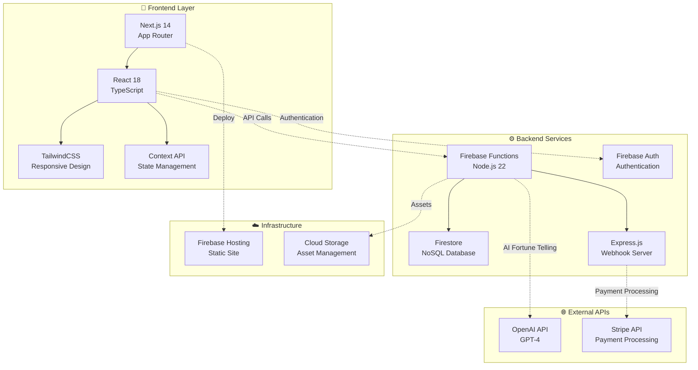

# 採用担当者様向け 自己開発コードの一部を公開

```mermaid
flowchart TB
    subgraph Frontend["🎨 Frontend Layer"]
        A["Next.js 14<br/>App Router"]
        B["React 18<br/>TypeScript"]
        C["TailwindCSS<br/>Responsive Design"]
        D["Context API<br/>State Management"]
    end
    
    subgraph Backend["⚙️ Backend Services"]
        E["Firebase Functions<br/>Node.js 22"]
        F["Firebase Auth<br/>Authentication"]
        G["Firestore<br/>NoSQL Database"]
        H["Express.js<br/>Webhook Server"]
    end
    
    subgraph APIs["🌐 External APIs"]
        I["OpenAI API<br/>GPT-4"]
        J["Stripe API<br/>Payment Processing"]
    end
    
    subgraph Infrastructure["☁️ Infrastructure"]
        K["Firebase Hosting<br/>Static Site"]
        L["Cloud Storage<br/>Asset Management"]
    end
    
    A --> B
    B --> C
    B --> D
    
    B -.->|API Calls| E
    B -.->|Authentication| F
    E --> G
    E --> H
    
    E -.->|AI Fortune Telling| I
    H -.->|Payment Processing| J
    
    A -.->|Deploy| K
    E -.->|Assets| L
```